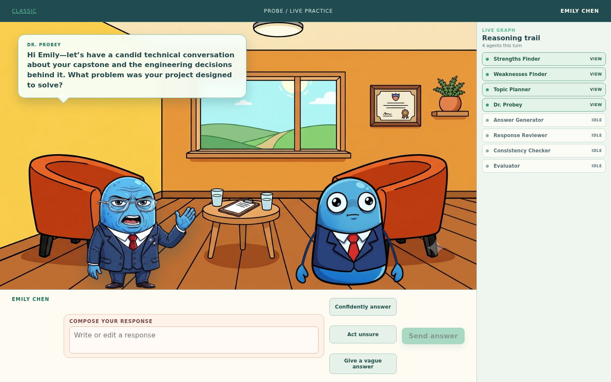

# Probe Interview

An evidence-led technical interview practice room that turns a candidate's real mission history into an adaptive conversation with Dr. Probey, then explains what the interview found.

[Live demo](https://probe.midhunpm.in)



## Contents

- [Features](#features)
- [Architecture](#architecture)
- [API](#api)
- [Getting Started](#getting-started)
- [Configuration](#configuration)
- [Development](#development)
- [Documentation](#documentation)
- [AI-Assisted Development](#ai-assisted-development)
- [License](#license)

## Features

- **Personalized interviews:** Builds a topic plan from roles, experience, mission outcomes, retries, and skips instead of a generic question bank.
- **Adaptive follow-ups:** Adjusts difficulty and asks one targeted probe when an answer is vague or incomplete.
- **Consistency checks:** Compares claims across turns so meaningful contradictions become useful interview questions.
- **Inspectable reasoning:** Shows a safe, per-turn agent trace without exposing model instructions.
- **Practice modes:** Generates confident, unsure, and vague answers for rapid exploration before a candidate writes their own response.
- **Actionable feedback:** Ends with strengths, gaps, next steps, and a recap of Dr. Probey's interview approach.

## Architecture

FastAPI exposes the interview API and serves the Vite/React frontend. LangGraph coordinates a stateful seven-agent pipeline and pauses after every question. Its checkpointer stores state by `sessionId` as the LangGraph `thread_id`, allowing the next HTTP request to resume the same interview without a hand-rolled session store.

| Agent | Role |
| --- | --- |
| Strengths Finder | Extracts evidence-backed strengths from mission history. |
| Weaknesses Finder | Identifies retries, failed work, and skipped missions worth exploring. |
| Topic Planner | Builds a short, role-aware topic plan from those signals. |
| Interviewer / Dr. Probey | Conducts the conversation with one focused question at a time. |
| Response Reviewer | Chooses whether to probe, advance, simplify, check in, or increase difficulty. |
| Consistency Checker | Tracks material conflicts between claims across turns. |
| Evaluator | Produces the final summary, strengths, gaps, next steps, and approach recap. |

Groq is available for fast specialist work, while OpenAI powers Dr. Probey's conversation and final evaluation. The provider abstraction keeps model routing configurable through environment variables; the committed defaults use OpenAI.

## Tech Stack

- **Backend:** FastAPI and Pydantic
- **Orchestration:** LangGraph `StateGraph` with a checkpointer
- **Models:** Groq and OpenAI
- **Frontend:** Vite and React
- **Deployment:** Docker, Dokploy, and Traefik

## API

`POST /api/interview` starts or resumes an interview. A request must provide exactly one of `candidate` or `message`.

```json
{
  "sessionId": "practice-emily-001",
  "candidate": {
    "member": { "id": "CAND-003", "name": "Emily Chen", "jobRole": "AI Engineer", "yearsExperience": 6, "education": "MS Artificial Intelligence", "status": "COMPLETED" },
    "missions": [{ "day": 7, "title": "Embeddings Explained", "passed": true, "attempts": 1 }],
    "signals": { "commitDays": 31, "missionsCompleted": 31, "missionsFirstTry": 30 }
  }
}
```

```json
{
  "reply": "What problem do embeddings solve in a retrieval system?",
  "done": false,
  "trace": [{ "agent": "Topic Planner", "output": { "topic_queue": [] } }]
}
```

Send later answers with the same `sessionId`:

```json
{ "sessionId": "practice-emily-001", "message": "They turn semantic similarity into a vector search problem." }
```

Completed responses set `done` to `true` and add `feedback` with `summary`, `strengths`, `gaps`, and `next`. See [PRD.md](PRD.md#5-api-contract-fixed-from-technical-specification) for the complete contract, validation behavior, trace details, and answer-simulation helper.

## Getting Started

### Requirements

- Python 3.13+
- Node.js 22+
- An OpenAI API key for the default routing configuration

```bash
git clone https://github.com/9MidhunPM/probe-interview.git
cd probe-interview
python3.13 -m venv .venv
. .venv/bin/activate
pip install -r requirements.txt
cp .env.example .env
npm --prefix frontend ci
npm --prefix frontend run build
python -m uvicorn app.main:app --reload
```

Set `OPENAI_API_KEY` in `.env`, then open [http://127.0.0.1:8000](http://127.0.0.1:8000). The application is public by design and protected by per-IP request and new-session rate limits.

## Configuration

| Variable | Purpose | Required |
| --- | --- | --- |
| `OPENAI_API_KEY` | Default model provider key | Yes for default routing |
| `GROQ_API_KEY` | Key for Groq-backed specialist routing | Only when selecting Groq |
| `ORCHESTRATOR_PROVIDER` | Provider for the interviewer and evaluator | No, defaults to `openai` |
| `REASONING_PROVIDER` | Provider for planning and review work | No, defaults to `openai` |
| `EXTRACTION_PROVIDER` | Provider for extraction and answer simulation | No, defaults to `openai` |
| `MAX_TURNS` | Maximum candidate answers in one interview | No, defaults to `15` |
| `RATE_LIMIT_REQUESTS_PER_MINUTE` | Per-IP request limit | No, defaults to `60` |
| `RATE_LIMIT_NEW_SESSIONS_PER_HOUR` | Per-IP interview-start limit | No, defaults to `10` |

See [.env.example](.env.example) for model names, retry settings, and optional Gemini fallback configuration.

## Development

```bash
. .venv/bin/activate
python -m pytest
npm --prefix frontend run build
```

The frontend build writes to `app/static`, which FastAPI serves at `/`. Use `/classic` for the art-free chat interface.

## Documentation

- [PRD.md](PRD.md) documents the product intent, API contract, agents, routing, and deployment model.
- [AGENT.md](AGENT.md) documents coding constraints and the system's build and verification expectations.

## AI-Assisted Development

Probe Interview was built with AI-assisted development: Claude supported planning and architecture, while GPT-5.6 Terra via OpenCode supported implementation. A fuller AI Usage Log will be added before submission.

## License

[MIT](LICENSE)
