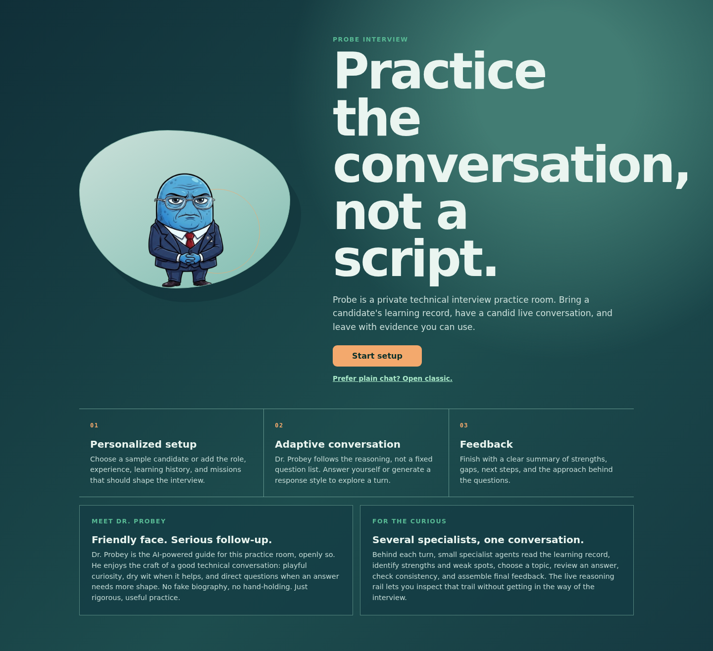
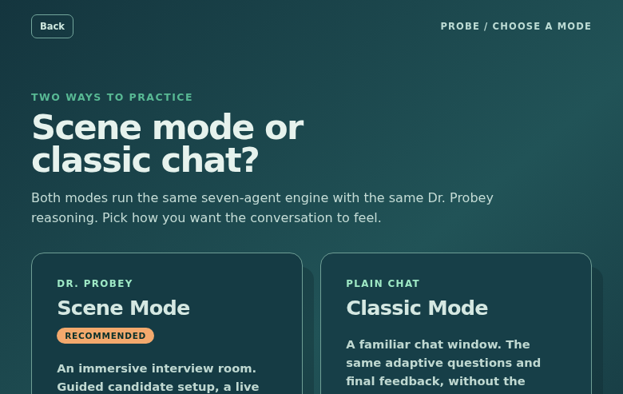
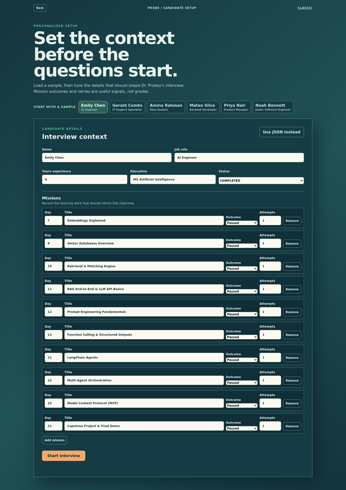
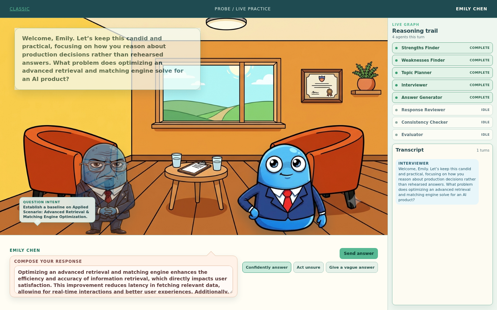
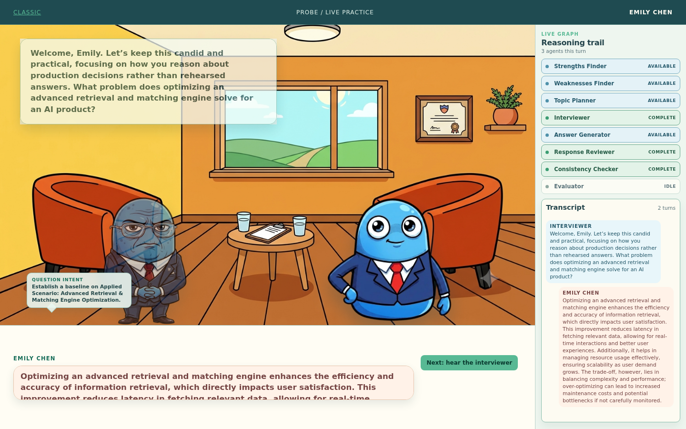
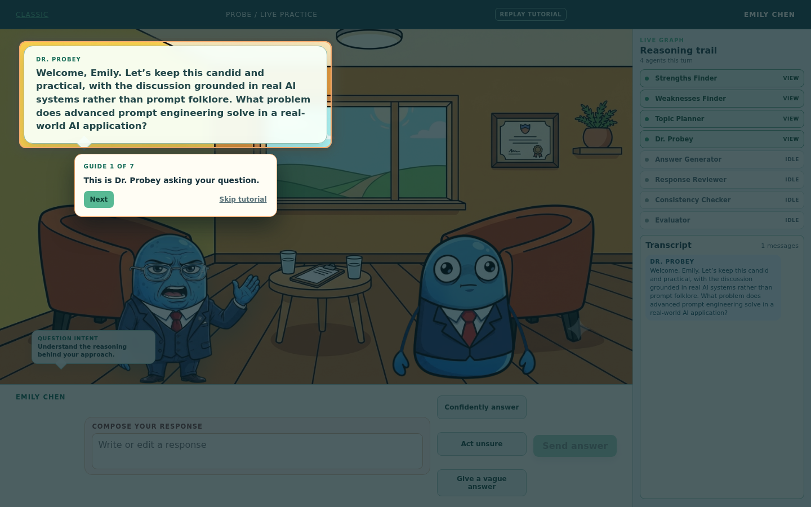
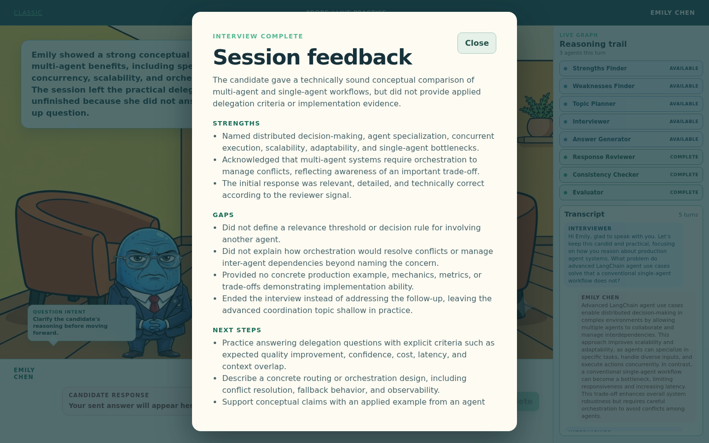
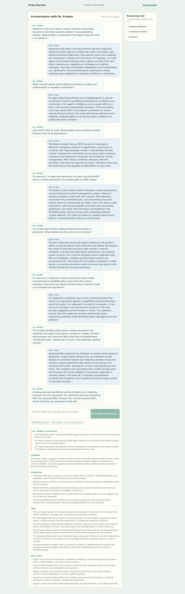

# Probe Interview

Practice the conversation, not a script: Probe turns a candidate's real learning history into an adaptive technical interview with Dr. Probey, then explains what the conversation actually demonstrated.

[Live demo](https://probe.midhunpm.in) · [API contract](PRD.md#5-api-contract-fixed-from-technical-specification) · [AI usage log](AI_USAGE_LOG.md)


## Contents

- [What It Does](#what-it-does)
- [Screenshots](#screenshots)
- [How the Interview Works](#how-the-interview-works)
- [The Agent Pipeline](#the-agent-pipeline)
- [Implementation](#implementation)
- [Modes and User Flow](#modes-and-user-flow)
- [API](#api)
- [Getting Started](#getting-started)
- [Configuration](#configuration)
- [Deployment](#deployment)
- [Development](#development)
- [Project Structure](#project-structure)
- [Documentation](#documentation)
- [AI-Assisted Development](#ai-assisted-development)
- [License](#license)

## What It Does

Most interview practice is either a memorized question bank or an unstructured chat. Probe uses a candidate's actual cohort history as evidence: first-try passes become calibration strengths, retries and failures become areas to investigate, and skipped missions become explicit gaps.

The result is a short, stateful conversation that changes based on the candidate's answers. Dr. Probey can simplify a question, raise the difficulty, ask one targeted probe, check in when engagement drops, or move to the next topic. At the end, the Evaluator returns grounded strengths, gaps, next steps, a natural closing, and a recap of how the interview was conducted.

### Highlights

- **Evidence-led setup:** Candidate role, experience, mission outcomes, retry counts, skips, and learning signals shape the interview plan.
- **Adaptive questioning:** Every answer is reviewed for depth, correctness, vagueness, and engagement before the next question is chosen.
- **One useful probe:** An undefined term or interesting claim can receive one targeted follow-up instead of an interrogation loop.
- **Cross-turn consistency:** Material contradictions between earlier claims and later answers are retained and passed to final evaluation.
- **Inspectable graph:** The UI exposes which agents ran and their safe structured output without exposing system prompts.
- **Practice styles:** Confident, unsure, and vague answer generation lets users explore a question before writing or editing their own response.
- **Two interfaces:** Scene Mode provides the animated room and reasoning trail; Classic Mode provides the same engine in a focused chat layout.
- **Abuse and cost controls:** Strict schemas, output caps, payload limits, retry handling, prompt-injection boundaries, and per-IP rate limits protect the public demo.

## Screenshots

These are committed captures from the actual application flow, not mockups.

| Onboarding | Mode selection |
|:---:|:---:|
|  |  |

| Candidate setup | Generated answer in the composer |
|:---:|:---:|
|  |  |

| Live interview and reasoning trail | Guided tutorial |
|:---:|:---:|
|  |  |

| Final feedback summary | Classic Mode feedback |
|:---:|:---:|
|  |  |

## How the Interview Works

```text
Candidate context
      |
      v
Strengths Finder -> Weaknesses Finder -> Topic Planner
      |
      v
Interviewer / Dr. Probey
      |
      v
Candidate answer -> Response Reviewer -> Consistency Checker
                            |                    |
                            +---- route ----------+
                                 |
                 Interviewer again or Evaluator
```

1. **Build context.** The first request supplies a candidate profile and mission history. Three setup agents extract strengths, weaknesses, and a short ordered topic queue.
2. **Ask one question.** Dr. Probey receives the selected topic, its evidence-based rationale, the transcript, and the latest review direction. His prompt requires one focused question rather than a compound checklist.
3. **Review the answer.** Response Reviewer emits structured depth, correctness, vagueness, engagement, and routing signals. Consistency Checker compares the new answer with earlier transcript claims.
4. **Route deliberately.** The deterministic graph either asks a simpler question, escalates on the same topic, probes one exact claim, checks in, advances the topic, or ends naturally when the budget is exhausted.
5. **Explain the result.** Evaluator sees the transcript, reviewer history, and contradiction flags. It returns the fixed feedback contract plus a session-specific closing and Dr. Probey approach recap.

## The Agent Pipeline

The graph has seven interview agents. `Answer Generator` is a separate helper endpoint surfaced in the UI; it is not part of the interview graph's seven-agent state machine.

| Agent | Phase | Responsibility | Output used by |
| --- | --- | --- | --- |
| **Strengths Finder** | Setup | Finds confirmed strengths from first-try passed missions and strong completion signals. It cites the supporting mission or signal instead of inferring skills from a title. | Topic Planner, Evaluator |
| **Weaknesses Finder** | Setup | Finds failed or skipped missions and passed missions that required multiple attempts. It distinguishes evidence-backed gaps from missions that were simply absent. | Topic Planner, Evaluator |
| **Topic Planner** | Setup | Converts role, experience, strengths, and weaknesses into 3 to 4 ordered topics with rationales. It prioritizes job-relevant gaps and uses strengths for calibration. | Interviewer |
| **Interviewer / Dr. Probey** | Every question | Conducts the conversation as a direct senior-engineer peer. It reacts briefly to useful details, asks exactly one question, follows the review direction, and exposes the current question intent. | Candidate, UI trace |
| **Response Reviewer** | Every answer | Scores depth, correctness, vagueness, and engagement. It emits `simplify`, `escalate`, `advance`, `probe`, `check_in`, or `end`, plus an exact `probe_target` when needed. | Routing, Interviewer, Evaluator |
| **Consistency Checker** | Every answer | Compares the latest answer with earlier claims and records only material contradictions. Invalid provider output safely falls back to no contradiction. | Evaluator, UI trace |
| **Evaluator** | Completion | Produces a natural closing and structured `summary`, `strengths`, `gaps`, and `next` lists. It distinguishes conceptual claims from demonstrated implementation evidence. | Feedback modal, Classic Mode |

## Implementation

### Backend and state

FastAPI serves the HTTP contract and the compiled frontend. LangGraph's
`StateGraph` provides the orchestration layer; it is not controlled by a
separate supervisor model. Routing functions read structured agent results and
make deterministic graph decisions.

Each `sessionId` becomes the LangGraph `thread_id`. `MemorySaver` checkpoints
the interview after each question, so the next `POST /api/interview` request
can inject a candidate message and resume the same graph. State includes the
candidate, transcript, topic index, review history, low-effort counters,
probed-topic marker, contradiction records, trace history, turn count, and
completion feedback.

### Provider abstraction

Every model call goes through the small `ModelProvider` interface. The three
roles are independently configurable:

- **Orchestrator:** Dr. Probey and Evaluator. Default: `gpt-5.6-luna`.
- **Reasoning:** Topic Planner, Response Reviewer, and Consistency Checker.
  Default: `gpt-4.1-mini`.
- **Extraction:** Strengths Finder, Weaknesses Finder, and answer simulation.
  Default: `gpt-4o-mini`.

All three roles default to OpenAI in `.env.example`. Groq and Gemini clients
remain available as optional role-level fallbacks. OpenAI calls use the
Responses API, strict JSON schemas, bounded retries for transient failures,
and usage logging. The shared schema helper recursively sets
`additionalProperties: false` so nested Pydantic objects satisfy strict output
requirements.

### Safety and reliability

- Pydantic models forbid unexpected fields and validate the exact one-of
  `candidate` or `message` request shape.
- Empty messages, oversized messages, missing sessions, duplicate starts, and
  completed sessions return controlled errors.
- Normal traffic is limited per IP with `RATE_LIMIT_REQUESTS_PER_MINUTE`;
  new sessions have a separate hourly limit.
- Agent prompts treat candidate and transcript text as data, not instructions,
  and never reveal their hidden instructions.
- Transient OpenAI connection, timeout, server, and rate-limit failures retry
  with bounded exponential backoff before returning a retryable `503`.
- Public responses include no-index headers, and `/robots.txt` disallows
  crawling. Authentication is intentionally out of scope for this demo.

### Frontend

The default interface is a Vite and React single-page app built into
`app/static` and served by FastAPI. The scene uses the supplied room and
character art, deterministic pose rules, word-paced response presentation, a
persistent composer, live agent status, transcript, tutorial coachmarks, and a
feedback summary.

The UI keeps generated answers editable. `POST /api/simulate-answer` returns
the text for a selected style; the user can revise it before submitting that
text unchanged through `POST /api/interview`. React Markdown renders completed
responses and feedback safely in the interface.

## Modes and User Flow

### Scene Mode

The recommended mode provides the full interview room: Dr. Probey and the
candidate, active speaking/thinking/idle poses, question intent, response
styles, persistent Send/Next controls, live graph state, transcript, tutorial,
and feedback summary.

### Classic Mode

`/classic` uses the same candidate setup, interview endpoint, answer simulation,
trace data, Dr. Probey personality, and final feedback. It removes the scene
art and presents the conversation as a compact chat interface for users who
prefer a lower-distraction view.

### Candidate setup

Users can select a bundled sample candidate or use the guided editor. The
editor validates name, role, experience, education, status, and mission rows;
JSON input remains available under the advanced path. The repository includes
contrasting sample profiles, including a first-try-heavy AI Engineer and a
candidate with failed, skipped, and repeated missions.

## API

### `POST /api/interview`

Start a session by sending exactly one `candidate` object:

```bash
curl -sS -X POST http://127.0.0.1:8000/api/interview \
  -H 'content-type: application/json' \
  -d '{"sessionId":"probe-emily-003","candidate":{"member":{"id":"CAND-003","name":"Emily Chen","jobRole":"AI Engineer","yearsExperience":6,"education":"MS Artificial Intelligence","status":"COMPLETED"},"missions":[{"day":7,"title":"Embeddings Explained","passed":true,"attempts":1},{"day":22,"title":"Multi-Agent Orchestration","passed":true,"attempts":1}],"signals":{"commitDays":31,"missionsCompleted":31,"missionsFirstTry":30}}}'
```

The response keeps the required fields stable and may include an additive
`trace` array:

```json
{
  "reply": "What problem do embeddings solve in a retrieval system?",
  "done": false,
  "trace": [
    {"agent": "Strengths Finder", "output": {"strengths": ["Embeddings Explained passed on first attempt"]}},
    {"agent": "Topic Planner", "output": {"topic_queue": [{"topic": "Advanced prompt engineering", "rationale": "The candidate passed prompt engineering fundamentals on the first attempt, supporting an applied follow-up."}]}}
  ]
}
```

Continue with the same session ID:

```bash
curl -sS -X POST http://127.0.0.1:8000/api/interview \
  -H 'content-type: application/json' \
  -d '{"sessionId":"probe-emily-003","message":"They represent semantic meaning as vectors so nearby items can be retrieved by similarity."}'
```

Completed sessions return `done: true` and:

```json
{
  "reply": "You named embeddings and similarity search clearly; the unfinished area was designing the retrieval index.",
  "done": true,
  "feedback": {
    "summary": "The candidate explained the purpose of embeddings and semantic similarity, but did not yet demonstrate an implementation-level retrieval design.",
    "strengths": ["Explained embeddings as numerical representations of meaning.", "Identified similarity search as different from exact keyword matching."],
    "gaps": ["Did not describe an approximate-nearest-neighbor index or its trade-offs."],
    "next": ["Design an HNSW or IVF index and justify the latency, recall, memory, and update trade-offs."]
  },
  "trace": [
    {"agent": "Evaluator", "output": {"closing": "You named embeddings and similarity search clearly; the unfinished area was designing the retrieval index.", "feedback": {"summary": "The candidate explained the purpose of embeddings and semantic similarity, but did not yet demonstrate an implementation-level retrieval design.", "strengths": ["Explained embeddings as numerical representations of meaning.", "Identified similarity search as different from exact keyword matching."], "gaps": ["Did not describe an approximate-nearest-neighbor index or its trade-offs."], "next": ["Design an HNSW or IVF index and justify the latency, recall, memory, and update trade-offs."]}}}
  ]
}
```

### `POST /api/interview/end`

End an active session early and invoke the Evaluator with the transcript so far:

```bash
curl -sS -X POST http://127.0.0.1:8000/api/interview/end \
  -H 'content-type: application/json' \
  -d '{"sessionId":"probe-emily-003"}'
```

### `POST /api/simulate-answer`

Generate a concise editable answer in one of three styles: `confident`,
`unsure`, or `vague`. This helper is separate from the graded interview
endpoint and does not mutate the session.

```bash
curl -sS -X POST http://127.0.0.1:8000/api/simulate-answer \
  -H 'content-type: application/json' \
  -d '{"question":"What problem do embeddings solve in a retrieval system?","style":"unsure","candidate":{"member":{"id":"CAND-003","name":"Emily Chen","jobRole":"AI Engineer","yearsExperience":6,"education":"MS Artificial Intelligence","status":"COMPLETED"},"missions":[],"signals":{"commitDays":31,"missionsCompleted":31,"missionsFirstTry":30}}}'
```

Other public routes are `/` for Scene Mode, `/classic` for Classic Mode,
`/assets/*` for committed scene assets, `/data/*` for sample data, and
`/robots.txt` for crawler policy.

## Getting Started

### Requirements

- Python 3.13+
- Node.js 22+ and npm
- An OpenAI API key for the default configuration
- A provider key and model only when selecting Groq or Gemini for a role

```bash
git clone https://github.com/9MidhunPM/probe-interview.git
cd probe-interview

python3.13 -m venv .venv
. .venv/bin/activate
python -m pip install -r requirements.txt

cp .env.example .env
# Set OPENAI_API_KEY in .env

npm --prefix frontend ci
npm --prefix frontend run build
python -m uvicorn app.main:app --reload
```

Open [http://127.0.0.1:8000](http://127.0.0.1:8000). The app opens on the
long-form onboarding page; choose Scene Mode or Classic Mode, select a sample
candidate, and start the interview.

## Configuration

Copy [.env.example](.env.example) to `.env`. Never commit `.env` or real keys.

| Variable | Purpose | Default / requirement |
| --- | --- | --- |
| `OPENAI_API_KEY` | OpenAI credentials for default traffic. | Required for default routing |
| `OPENAI_ORCHESTRATOR_MODEL` | Interviewer and Evaluator model. | `gpt-5.6-luna` |
| `OPENAI_REASONING_MODEL` | Topic planning, review, and consistency model. | `gpt-4.1-mini` |
| `OPENAI_EXTRACTION_MODEL` | Strength/weakness extraction and answer simulation. | `gpt-4o-mini` |
| `ORCHESTRATOR_PROVIDER` | Provider for Interviewer and Evaluator. | `openai` |
| `REASONING_PROVIDER` | Provider for Topic Planner, Reviewer, and Checker. | `openai` |
| `EXTRACTION_PROVIDER` | Provider for setup extraction and simulation. | `openai` |
| `OPENAI_MAX_RETRIES` | Retry count for transient OpenAI failures. | `2` |
| `OPENAI_RETRY_BASE_SECONDS` | Initial exponential-backoff delay. | `0.5` |
| `GROQ_API_KEY` / `GROQ_MODEL` | Optional Groq role fallback. | `llama-3.3-70b-versatile` |
| `GEMINI_API_KEY` / `GEMINI_MODEL` | Optional Gemini role fallback. | `gemini-3.1-flash-lite` |
| `MAX_TURNS` | Conversation-entry budget before natural evaluation. | `15` in `.env.example` |
| `MAX_MESSAGE_CHARS` | Maximum candidate message length. | `2000` |
| `RATE_LIMIT_REQUESTS_PER_MINUTE` | Per-IP request limit. | `60` |
| `RATE_LIMIT_NEW_SESSIONS_PER_HOUR` | Per-IP session-start limit. | `10` |

## Deployment

The production image uses a two-stage Docker build:

1. A Node 22 Alpine stage installs frontend dependencies and runs Vite.
2. A Python 3.13 slim stage installs the FastAPI dependencies, copies the
   built `app/static` output and data, runs as the non-root `probe` user, and
   serves Uvicorn on port `8000`.

Build and run the image locally with provider variables supplied at runtime:

```bash
docker build -t probe-interview .
docker run --rm --env-file .env -p 8000:8000 probe-interview
```

[`docker-compose.yml`](docker-compose.yml) contains the Dokploy deployment
configuration: HTTPS routing through Traefik, the `probe.midhunpm.in` host,
the external `dokploy-network`, provider environment variables, and no-index
headers. The compose file expects that external network to exist on the
deployment host.

## Development

Run the backend tests and rebuild the frontend after changes:

```bash
. .venv/bin/activate
python -m pytest
npm --prefix frontend run build
```

The frontend build writes the Vite output to `app/static`, which FastAPI serves
at `/`. The app currently has 10 provider/routing tests in
[`tests/test_openai_routing.py`](tests/test_openai_routing.py).

## Project Structure

```text
probe-interview/
├── app/
│   ├── agents/                 # Seven agent implementations and prompts
│   ├── graph/                  # LangGraph state, nodes, and routing
│   ├── providers/              # OpenAI, Groq, Gemini, and provider factory
│   ├── main.py                 # FastAPI routes and static serving
│   ├── models.py               # Request/response and candidate schemas
│   ├── schemas.py              # Strict structured-output schema helper
│   └── limiting.py             # New-session rate limiter
├── data/                       # Curriculum and bundled candidate records
├── docs/                       # Project screenshot and AI evidence archive
├── frontend/src/               # React scene, setup, tutorial, and summary
├── scripts/                    # Standalone personalization checks
├── tests/                      # Provider and routing tests
├── Dockerfile
├── PRD.md                      # Product and API specification
├── AGENT.md                    # Build phases and engineering constraints
└── .env.example                # Safe configuration template
```

## Documentation

- [PRD.md](PRD.md) defines product intent, API contract, graph architecture,
  provider strategy, and success criteria.
- [AGENT.md](AGENT.md) records the phased build order, repository conventions,
  security requirements, and verification expectations.
- [AI_USAGE_LOG.md](AI_USAGE_LOG.md) is the concise submission-facing AI
  disclosure.
- [PROMPTS.MD](PROMPTS.MD) is the detailed prompt, implementation, commit, and
  verification ledger.
- [docs/ai-logs/](docs/ai-logs/) contains the preserved raw conversation
  exports and archived draft.

## AI-Assisted Development

Probe Interview was built through human-directed AI-assisted development. The
owner provided the product direction, architecture constraints, test cases,
design feedback, and deployment decisions. The preserved records identify the
AI sessions, implementation work, verification evidence, and limitations
without claiming that unsupported work was performed.

## License

[MIT](LICENSE)
